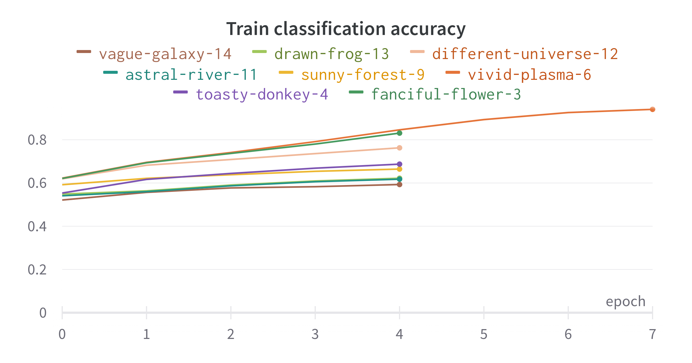
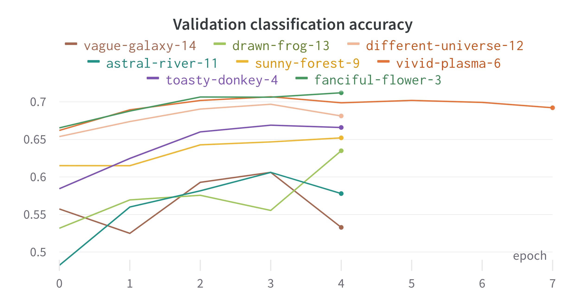
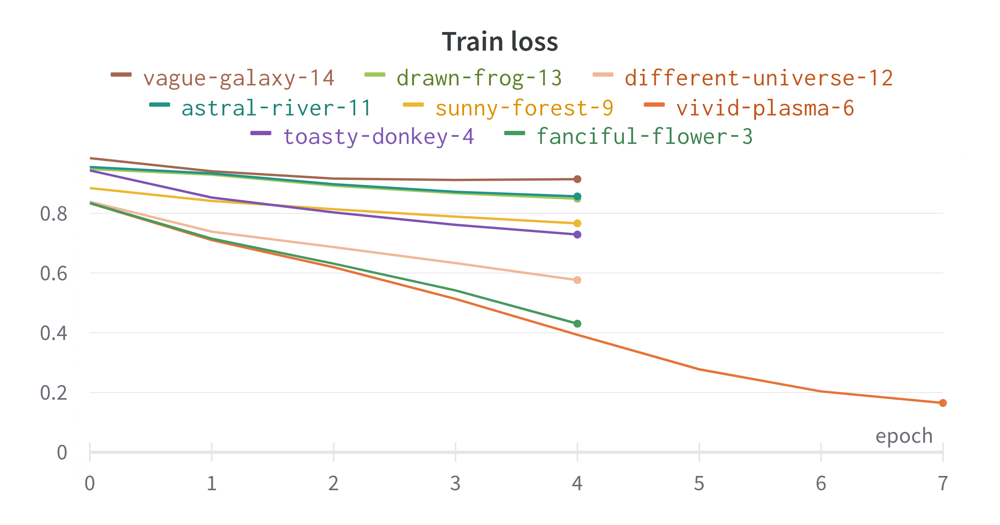
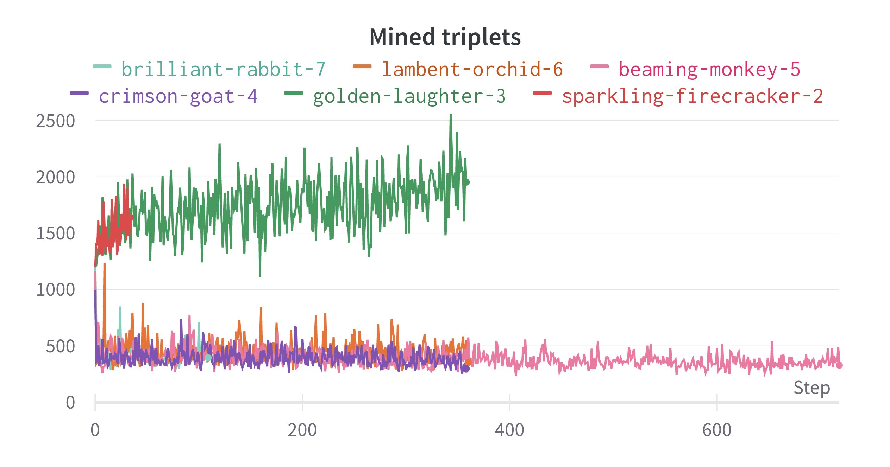
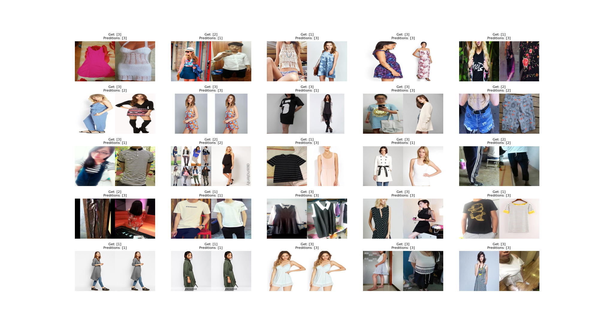
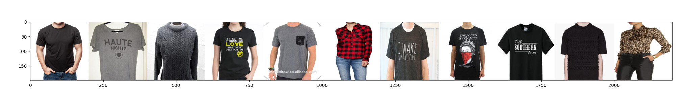
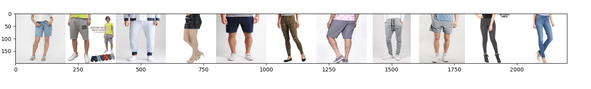

<center>

Clothes matcher
====

</center>

# About
Bachelor project on Poznan University of Technology (PUT) consists of 2 neural networks models and rest API server for communication with mobile application designed for that project. The project goal was to recommend similar photos of clothes based on uploaded photos by users.

----

# Dataset 
For dataset information take a look at [readme](data/datasets/README.md) in [data/datasets](data/datasets) directory.
# Models 
In carrying out that, convolutional neural networks from the area of image classification and metric learning were used.
## Classification model
The classification model based on resnet architecture to clasify clothes by labels difined for dataset. 
Last layers was modified by adding linear transformation with dropout layers and downsampling linear transformation with 512 fetures to final value of 3.
In training process there was used cross entropy loss and adam optimizer with l1 nad l2 penalties.
## Metric model
The metric model is a modification of classification one. The final layer returns embedding vector with size of (100,1). For training process there were used triplet margin miners with tripple margin loss function. Optimizer hasn't been changed (Adam). Due to hardware limitations of GPU VRAM (RTX2060) a distance  calculation between embeddings by cosine similarity was performed on CPU. 

# Results

Training processes have been monitored with [wandb](https://wandb.ai/).
That tool was used to generate below plots. 

## Classification model





Best results were achived at 71% accuracy level for `fanciful-flower-3` run based on ResNet34 architecture and learning_rate = 0.0001. 
## Metric model




Due to largest number of mined triples in `golden-laugher-3` run, it was selected as the best result. 

Below there are resuls of that run.



In the following charts first image is an input, the others are the closest matches returned by metric model.





# How to run
Create conda enviroment using following command:
```bash
conda env create -f env.yml
```
Start local http server by executing following command:
```bash
python src/server/server.py
```

For training models type below commands:
- classification model
```bash 
python src/train.py
```
- metric model
```bash 
python src/train_metric.py
```
Above scripts use argparse library for setting up hyperparameters like batch size or number of epochs. Run them with  `--help` parameter for more details.

---

